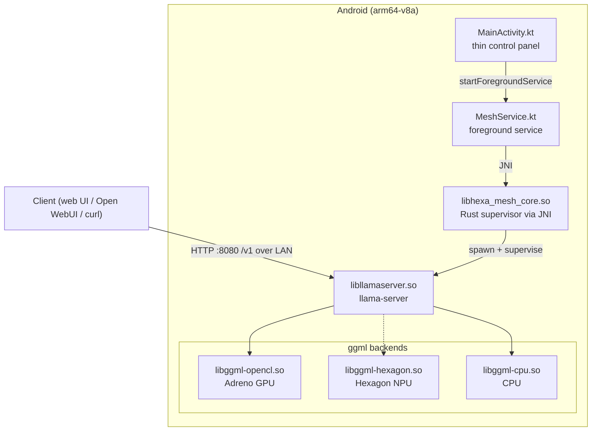

<h1 align="center">HexaMesh</h1>

<p align="center">
    <picture>
      <source media="(prefers-color-scheme: dark)" srcset="https://raw.githubusercontent.com/LuMarans30/HexaMesh/main/docs/logo-dark.svg">
      <source media="(prefers-color-scheme: light)" srcset="https://raw.githubusercontent.com/LuMarans30/HexaMesh/main/docs/logo-light.svg">
      
    </picture>
</p>

HexaMesh runs [llama.cpp](https://github.com/ggml-org/llama.cpp)'s `llama-server` in an Android foreground service and exposes an OpenAI-compatible API on your LAN.

You can use the built-in llama.cpp web UI, Open WebUI, or plain `curl`.

The long-term goal is Snapdragon Hexagon NPU inference and, eventually, meshing phones over llama.cpp RPC. That part is not built yet.

> [!IMPORTANT]
> HexaMesh currently launches the Adreno GPU (OpenCL) backend. The Hexagon NPU backend is experimental and currently produces corrupted output on tested models.
>
> The server listens on port `8080`. Pick a `.gguf` in the app and tap **Start Node** to serve it; the choice is remembered until you pick another.

## Architecture



## Building

**1. Build llama.cpp for Snapdragon**

```bash
git clone https://github.com/LuMarans30/HexaMesh
cd HexaMesh
./build_llama.sh
```

This fetches the web UI assets and builds llama.cpp. Gradle picks the artifacts up from `llama.cpp/pkg-adb/llama.cpp/` automatically.

**2. Install the app**

Connect the phone to your PC via USB and enable USB debugging.

```bash
cargo install cargo-ndk
rustup target add aarch64-linux-android
./gradlew installDebug
```

## Running

Push a GGUF model:

```bash
adb shell mkdir -p /storage/emulated/0/Android/data/com.lumarans30.hexamesh/files/models
adb push <YOUR_MODEL_NAME>.gguf /storage/emulated/0/Android/data/com.lumarans30.hexamesh/files/models/
```

Then open the app, select the model, and tap **Start Node**. Once it is serving, the app shows the LAN endpoint and API key. From another device on the same network, use:

```text
http://<phone-ip>:8080/v1
```

For USB testing:

```bash
adb forward tcp:8080 tcp:8080
```

Then use:

```text
http://localhost:8080/v1
```

The API key is generated once and reused until app data is cleared. Clients must send it as:

```text
Authorization: Bearer $API_KEY
```

Quick test:

```bash
curl -H "Authorization: Bearer $API_KEY" http://localhost:8080/v1/models
```

If something fails, check the logs:

```bash
adb logcat -s HexaRust MeshService LlamaServer
```

HexaMesh serves plain HTTP, so use it only on trusted local networks.

## Acknowledgements

- [llama.cpp](https://github.com/ggml-org/llama.cpp)
- [Qualcomm's Hexagon SDK](https://github.com/snapdragon-toolchain/hexagon-sdk)