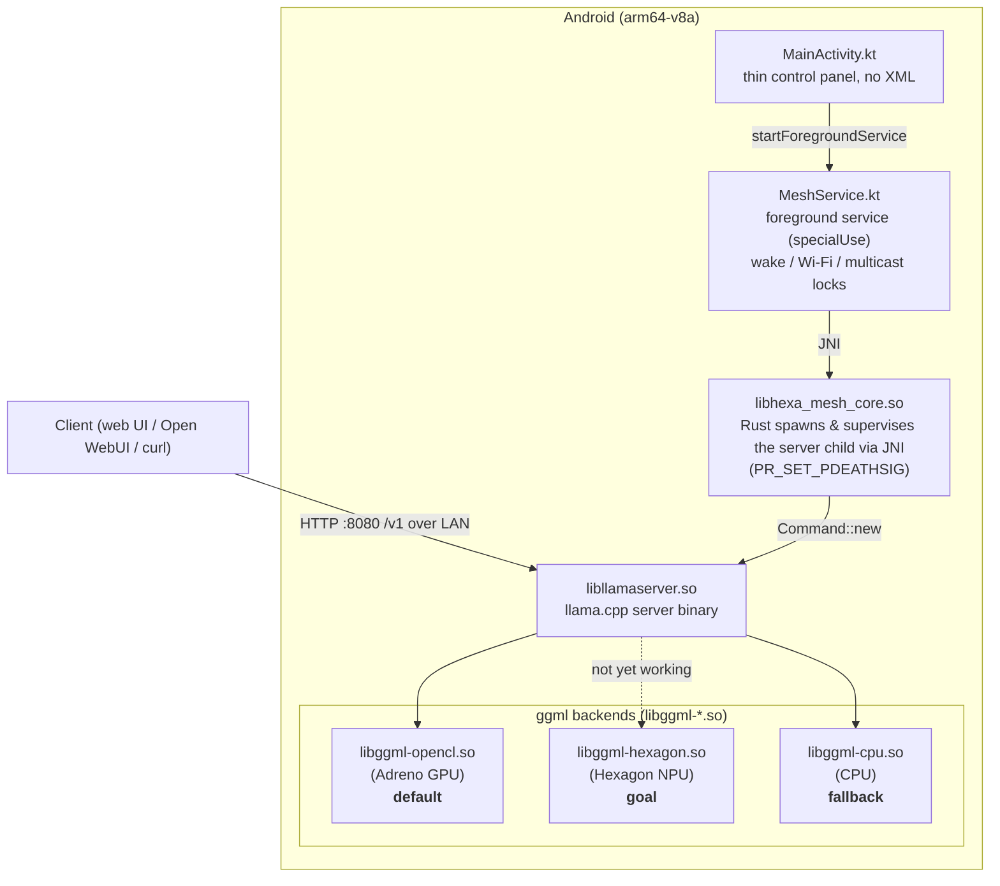

<h1 align="center">HexaMesh</h1>

<p align="center">
    <picture>
      <source media="(prefers-color-scheme: dark)" srcset="https://raw.githubusercontent.com/LuMarans30/HexaMesh/main/docs/logo-dark.svg">
      <source media="(prefers-color-scheme: light)" srcset="https://raw.githubusercontent.com/LuMarans30/HexaMesh/main/docs/logo-light.svg">
      
    </picture>
</p>

An Android app that runs [llama.cpp](https://github.com/ggml-org/llama.cpp)'s `llama-server` in a foreground service, turning a phone into a headless, OpenAI-compatible API endpoint on your LAN. Open the llama.cpp server web UI at [http://localhost:8080](http://localhost:8080) or use your preferred frontend.

The goal is inference on the Snapdragon Hexagon NPU with phones eventually meshing over llama.cpp's RPC server to host larger models (not built yet).

> [!IMPORTANT]
> The app currently defaults to the Adreno GPU (OpenCL) backend. The Hexagon NPU backend only outputs corrupted text on tested models (Qwen 3.5 0.8B, LFM2.5 2.6B).

## Architecture



## Building

**1. Build llama.cpp for Snapdragon** (requires Docker):

```bash
git clone https://github.com/LuMarans30/HexaMesh
cd HexaMesh
./build_llama.sh
```

This script fetches the web UI assets and builds llama.cpp. Gradle then picks the artifacts up from `llama.cpp/pkg-adb/llama.cpp/` automatically in the next step.

**2. Install the app** (requires Android SDK and Rust with `cargo-ndk`):

First connect the phone to the PC via USB and enable USB debugging. 

```bash
cargo install cargo-ndk
rustup target add aarch64-linux-android
./gradlew installDebug
```

## Running

Push a GGUF model:

```bash
adb shell mkdir -p /storage/emulated/0/Android/data/com.lumarans30.hexamesh/files/models
adb push <YOUR_MODEL_NAME>.gguf /storage/emulated/0/Android/data/com.lumarans30.hexamesh/files/models/
```

Open the app, grant notification permission and the battery-optimization exemption. The screen shows the LAN endpoint (e.g. `http://192.168.1.85:8080/v1`) and the API key.

The endpoint is protected by `--api-key`, so clients must send the key shown on screen.

Quick test over USB (replace `$API_KEY` with the key shown in the app):

```bash
adb forward tcp:8080 tcp:8080
curl -H "Authorization: Bearer $API_KEY" http://localhost:8080/v1/models
```

## Acknowledgements

- [llama.cpp](https://github.com/ggml-org/llama.cpp)
- [Qualcomm's Hexagon SDK](https://github.com/snapdragon-toolchain/hexagon-sdk)